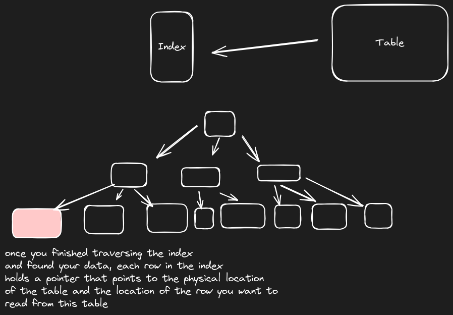
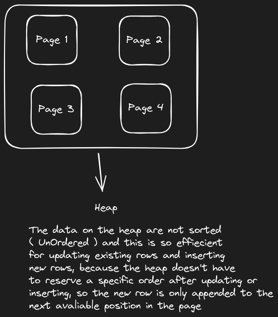
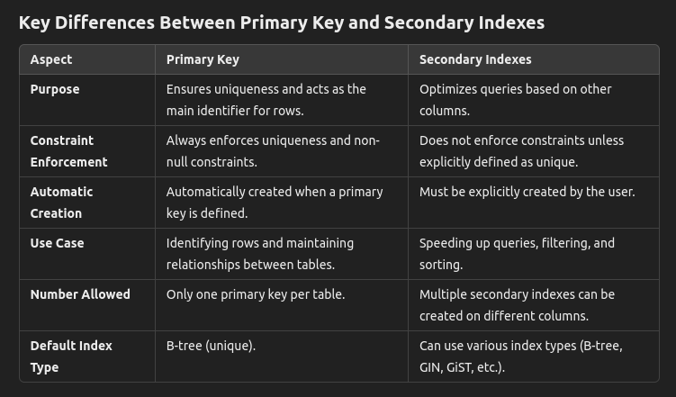
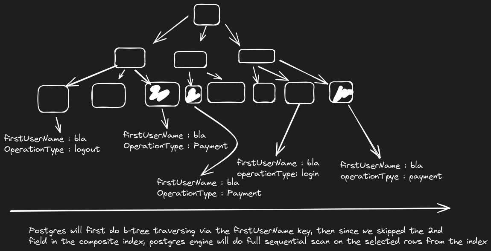

# postgres-night
today i will be good at postgres - back to relational dbs

# Data Types : 

## Numeric data types :
- integeres representation
```sql
age int2 -- this means an integer that stores only 2 bytes, so from -2^15 to 2^15 
id_card integer -- this means an integer that stores 4 bytes 
file_size bigint -- this means an integer that stores 8 bytes 
```

- decimals representation
```sql
salary numeric(5, 3) -- means 5 digits in total, 3 digits after the percision 
bonus numeric 
-- so numeric(percision, scale)
```

- floating numbers
```sql
salary real -- real is a float number with 4 bytes
salary double percision  -- 8 bytes 
```

> when dealing with financials and money, use `numeric` not `float` because its more accurate, **BUT** `float` is faster than `numeric` when it comes to do operations on it.

- money storing in database ?
> don't use money type to represent money in your system because you will lose percision 
```sql
test=# select 199.96::money;
  money  
---------
 $199.96
(1 row)

test=# select 199.964::money;
  money  
---------
 $199.96
(1 row)

test=# select 199.966::money;
  money  
---------
 $199.97
(1 row)
```
so to store money, you have 2 options, either `numeric` or `integer` becasue `floating` are not percise too !

Let's see how we store money as integers : 
- in the way in the database (From app to db)
let's say we agreed we need to store up to 4 percisions 
```sql
-- salary entered from app is 40000.456 where its 40k dollars and 456 cents :) 
test=# select (40000.456*10000)::integer as dollarsWithCents from employees;
 dollarswithcents 
------------------
        400004560
(1 row)
```

- in the way out from the database (From db to app)
```go
package main

import "log"

func main() {
	salary := int64(db.query('select dollarsWithCents from employees'))
	log.Printf("%.4f\n", float64(salary)/10000)
}
```

## Constraints [Column level and Table level] : 
- It's good to use constraints to enforce data integrity on your domains.
```sql
postgres=# create table users(
postgres(#   username varchar(255),
postgres(#   salary numeric constraint salary_must_be_positive check(salary > 0),
postgres(#   kpi numeric constraint kpi_must_be_positive check(kpi > 0), -- column level constraint 
postgres(#   -- table level constraint is used when we need to add constraints between columns against each others
postgres(#   check(salary > (kpi * 2))
postgres(# );
CREATE TABLE
```

## Search text in postgres: 
- we use `ts_vector` type to store our text as vector data type which is a `sorted list` of the atomic words with their locations from the sentence.
- then we can use the `ts_query` type to check if our query param is inside the ts_vector list 
```sql
postgres=# select to_tsvector('fady gamil mahrous is a backend engineer at halan, fady is responsible');
                                  to_tsvector                                   
--------------------------------------------------------------------------------
 'backend':6 'engin':7 'fadi':1,10 'gamil':2 'halan':9 'mahrous':3 'respons':12
(1 row)

postgres=# select to_tsquery('fady');
 to_tsquery 
------------
 'fadi'
(1 row)

postgres=# select to_tsvector('fady gamil mahrous is a backend engineer at halan, fady is responsible') @@ to_tsquery('fady');
 ?column? 
----------
 t
(1 row) 

postgres=# select to_tsvector('fady gamil mahrous is a backend engineer at halan, fady is responsible') @@ to_tsquery('fadi');
 ?column? 
----------
 t
(1 row)

postgres=# select to_tsvector('fady gamil mahrous is a backend engineer at halan, fady is responsible') @@ to_tsquery('fadia');
 ?column? 
----------
 f
(1 row)
```


## Foreign Key Constraints:
- foreign key is a concept to enforce the `referential integrity`.
```sql
test=# CREATE TABLE A (
  id bigint generated always as identity primary key, -- primary key constraint 
  x text 
);
CREATE TABLE
test=# CREATE TABLE B (
  id bigint generated always as identity primary key, -- primary key constraint 
  a_id bigint references A(id) -- foreign key constraint
);
```

- we cannot delete or update the parent row if it references by a child row unless we specify the level of restrictions on the FK
1. No-Action === Restrict
the following schema will return an error if you tried to remove parent table row before removing the childs the references this row
```sql
test=# CREATE TABLE A (
  id bigint generated always as identity primary key, -- primary key constraint 
  x text 
);
CREATE TABLE
test=# CREATE TABLE B (
  id bigint generated always as identity primary key, -- primary key constraint 
  a_id bigint references A(id) on delete no action -- foreign key constraint
);
```

## Indexes in PostgreSQL :


- How data are stored into postgres ? 
data are stored into a heap (collection of pages)
```sql
test=# create table users(id bigint primary key, name varchar(50));
CREATE TABLE
test=# insert into users (id, name) values (1, 'fady'), (2, 'nader'), (3 , 'filo'), (4, 'mokhtar');
INSERT 0 4
test=# select *, ctid from users;
  1 | fady    | (0,1)
  2 | nader   | (0,2)
  3 | filo    | (0,3)
  4 | mokhtar | (0,4)

test=# 
```

and the `ctid` is what excatly indexes contains to be able to reach the row 
the `ctid(0,1)` means `your row is at page 0 and row 1` 

- data storage model in postgres is using HEAP to be optomised for C & U from the CRUD ?



- what are the type of any index we create in postgres ? 
any index in postgres is a `secondary index`

- does primary key is considered as secondary idnex ? 
primary key is an index, but its a special type of the secondary index because it enforces: (being not null and being unique) <br>
but the secondary index could be not unique 



## what is the best data type for your primary key ? 
```sql
test=# create table data ( id bigint generated always as identity primary key, name text);
CREATE TABLE
test=# insert into data (name) values ('fady'), ('gamil');
INSERT 0 2
test=# select * from data;
 id | name  
----+-------
  1 | fady
  2 | gamil
(2 rows)
```

also we can use the UUID v7 which holds the first 7 digits as the timestamp so it preserves the order of the generated keys which help in the re-organization of your B-Tree index (pk architecture).

## How to choose the column that will be a good index ? 
- we should choose the column that gives us the nearest `selectivity` to `1`
```sql
test=# select * from data;
 id |   name    | is_pro_user 
----+-----------+-------------
  1 | fady      | t
  2 | gamil     | f
  3 | mahrous   | f
  4 | masoud    | f
  5 | ahmed     | f
  6 | mohamed   | f
  7 | amir      | t
  8 | filopater | f
  9 | nader     | t
 10 | nadim     | f
 11 | fahmy     | f
 12 | madonna   | t
(12 rows)

test=# select count(distinct name)::decimal / count(*)::decimal from data;
        ?column?        
------------------------
 1.00000000000000000000
(1 row)

test=# select count(distinct is_pro_user)::decimal / count(*)::decimal from data;
        ?column?        
------------------------
 0.16666666666666666667
(1 row)
```
<br> 
with the selectivity metric, you also should consider the access-pattern you will use, because what if u will frequently read the all pro users ? in this case the index on this column will be useful 

<br>

> when your query on an indexed column gives you large amount of data (more than half of the table) Postgres engine will ignore the index and perform parallel scan on the entire table.


## What about composite b-tree index ? 
- Always follow the rule `first -> last -> but no skipping`
```sql
test=# create table metadata (id bigint generated always as identity primary key, operationType varchar(50), description text, firstUserName varchar(255), lastUserName varchar(255));
CREATE TABLE
test=# create index firstLastOperationTypeIdx on metadata using btree(firstUserName, lastUserName, operationType);
CREATE INDEX
```

if our read query : 
```sql
select from metadata
where lastUserName = 'bla bla';
```
this will search using full table scan not the created index 

but if we write it this way 
```sql
select from metadata 
where firstUserNmae = 'bla' and lastUserName = 'bla bla';
```
this will use the index 

but if we skip the lastUserName and write it this way 
```sql
select from metadata 
where firstUserNmae = 'bla' and operationType = 'payment';
```
this will use the index, but this will do the following :


> keep your most common filters on the left of your composite index